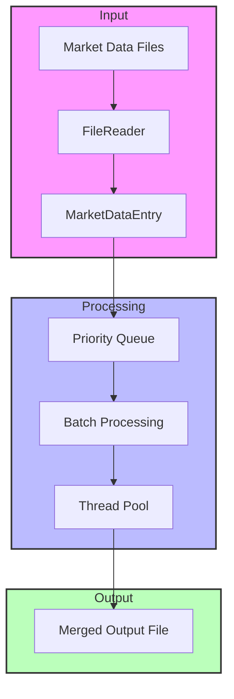
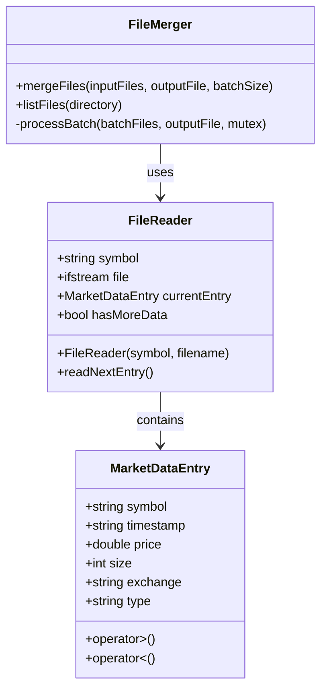
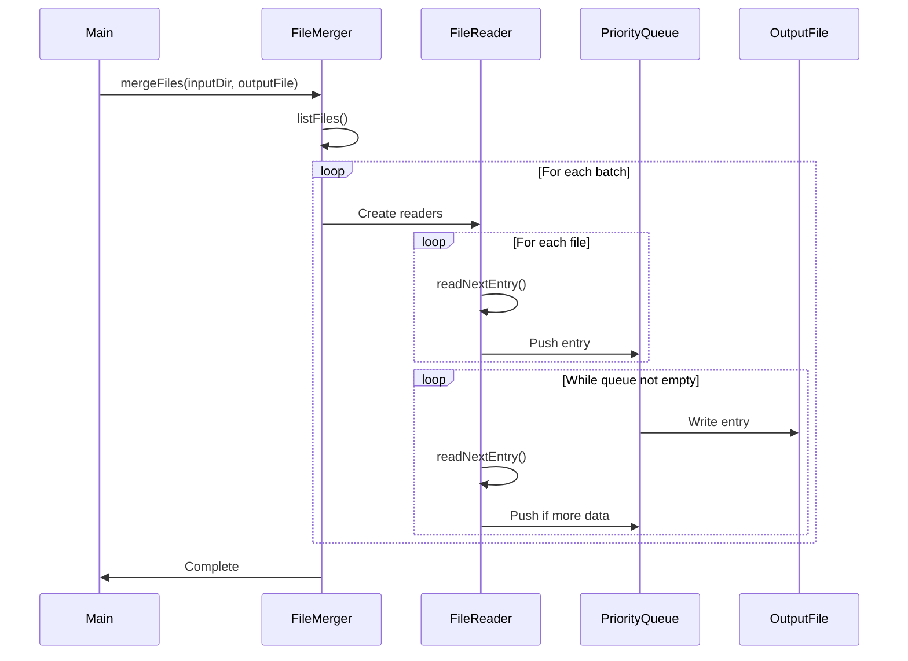
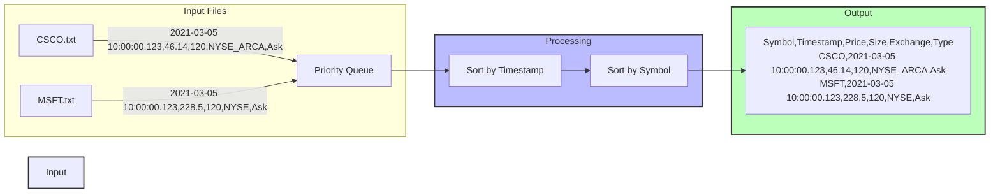
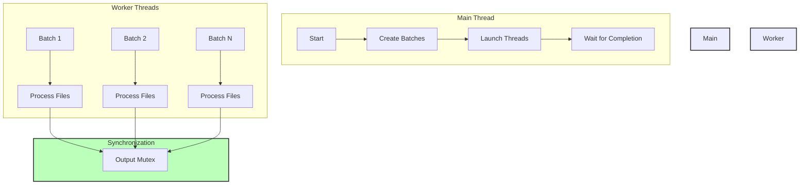

# Market Data Merger System Documentation

This document provides visual representations and explanations of the Market Data Merger system architecture and components.

## 1. System Architecture



The system architecture shows the three main components:
- **Input**: Handles reading market data files and converting them into structured entries
- **Processing**: Manages the merging logic using priority queues and batch processing
- **Output**: Generates the final merged file with properly ordered entries

## 2. Data Structures



Key data structures and their relationships:
- `MarketDataEntry`: Represents a single market data record
- `FileReader`: Manages reading and parsing of individual input files
- `FileMerger`: Coordinates the overall merging process

## 3. Process Flow



The sequence diagram shows:
1. Initial file listing and batch creation
2. File reading and entry processing
3. Priority queue management
4. Output file writing
5. Thread synchronization

## 4. Data Flow



Data flow illustration:
- Input files are read and parsed
- Entries are sorted by timestamp and symbol
- Final output maintains proper ordering

## 5. Threading Model



Threading model features:
- Main thread manages batch creation and thread coordination
- Worker threads process file batches in parallel
- Output mutex ensures thread-safe file writing

## Usage Example

Input file (CSCO.txt):
```
Timestamp,Price,Size,Exchange,Type
2021-03-05 10:00:00.123,46.14,120,NYSE_ARCA,Ask
2021-03-05 10:00:00.130,46.13,120,NYSE,TRADE
```

Output file (merged_output.txt):
```
Symbol,Timestamp,Price,Size,Exchange,Type
CSCO,2021-03-05 10:00:00.123,46.14,120,NYSE_ARCA,Ask
MSFT,2021-03-05 10:00:00.123,228.5,120,NYSE,Ask
CSCO,2021-03-05 10:00:00.130,46.13,120,NYSE,TRADE
```

## Key Features

1. **Efficient Processing**
   - Batch processing to manage system resources
   - Multithreaded execution for improved performance
   - Memory-efficient line-by-line processing

2. **Data Integrity**
   - Strict timestamp ordering
   - Secondary symbol ordering for same timestamps
   - Thread-safe output file writing

3. **Error Handling**
   - Robust file I/O error handling
   - Proper resource cleanup
   - Exception safety

4. **Cross-Platform**
   - Platform-independent path handling
   - Consistent file format processing
   - Standard C++17 features 