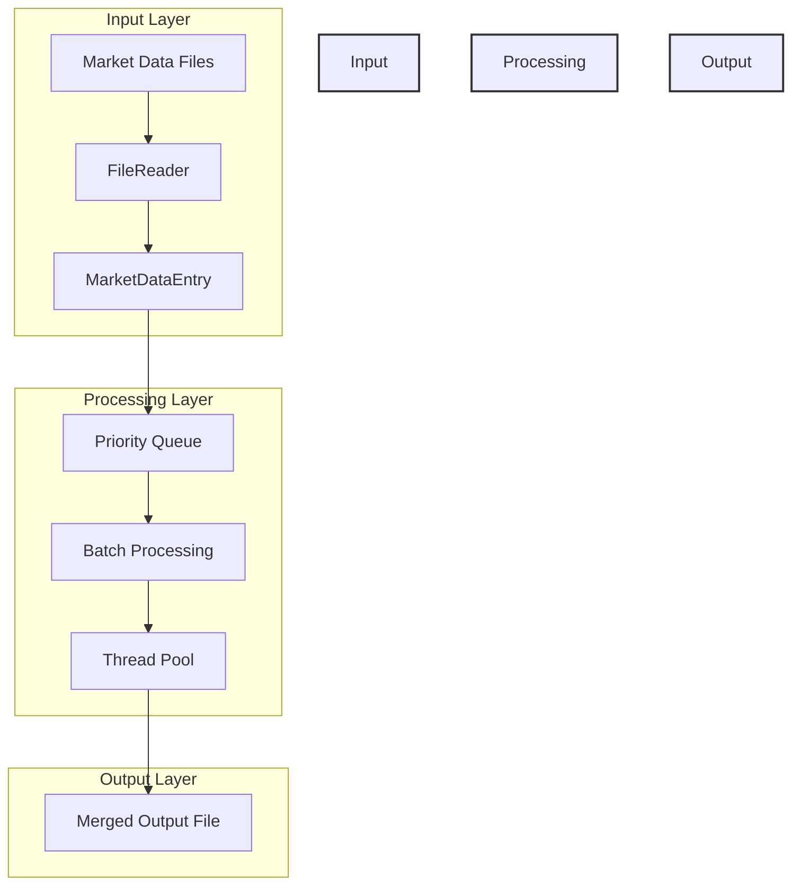
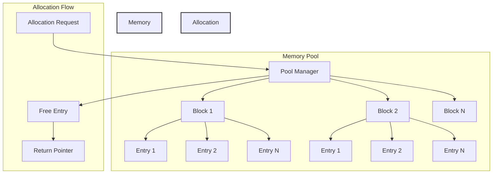
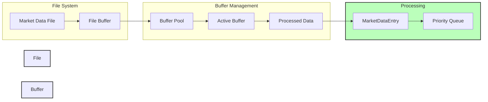
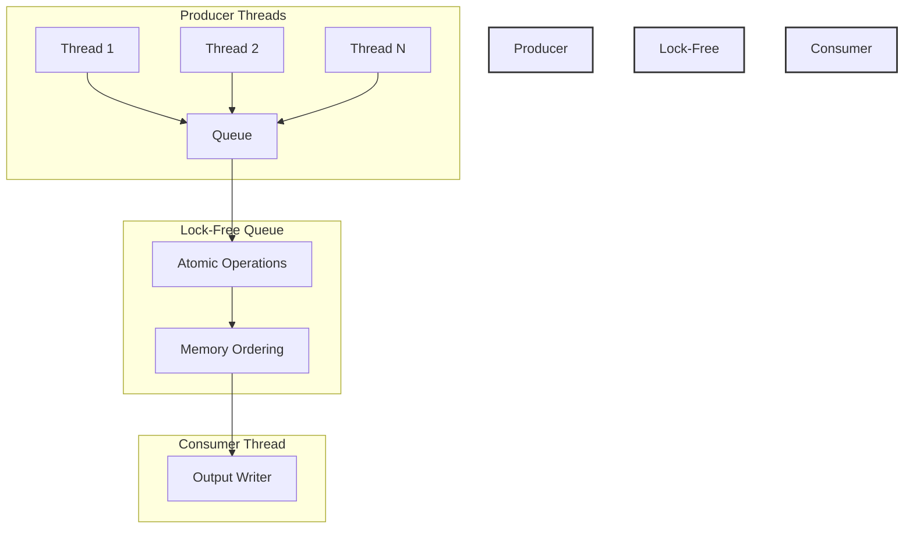
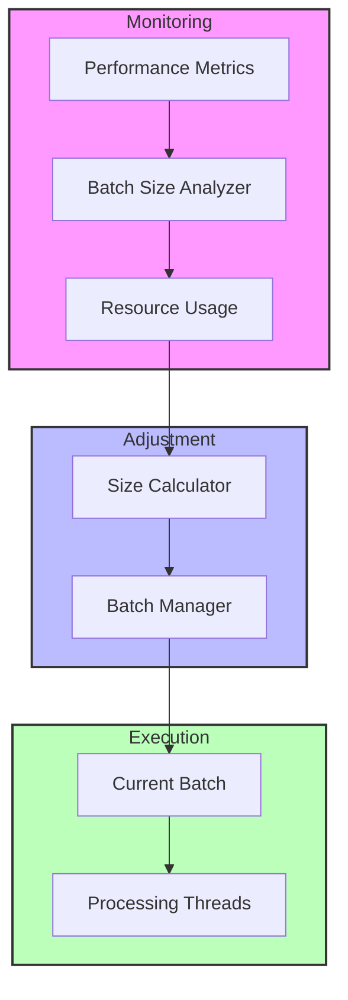
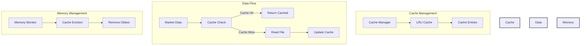
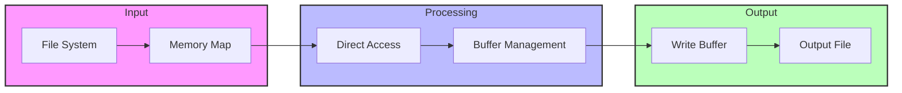
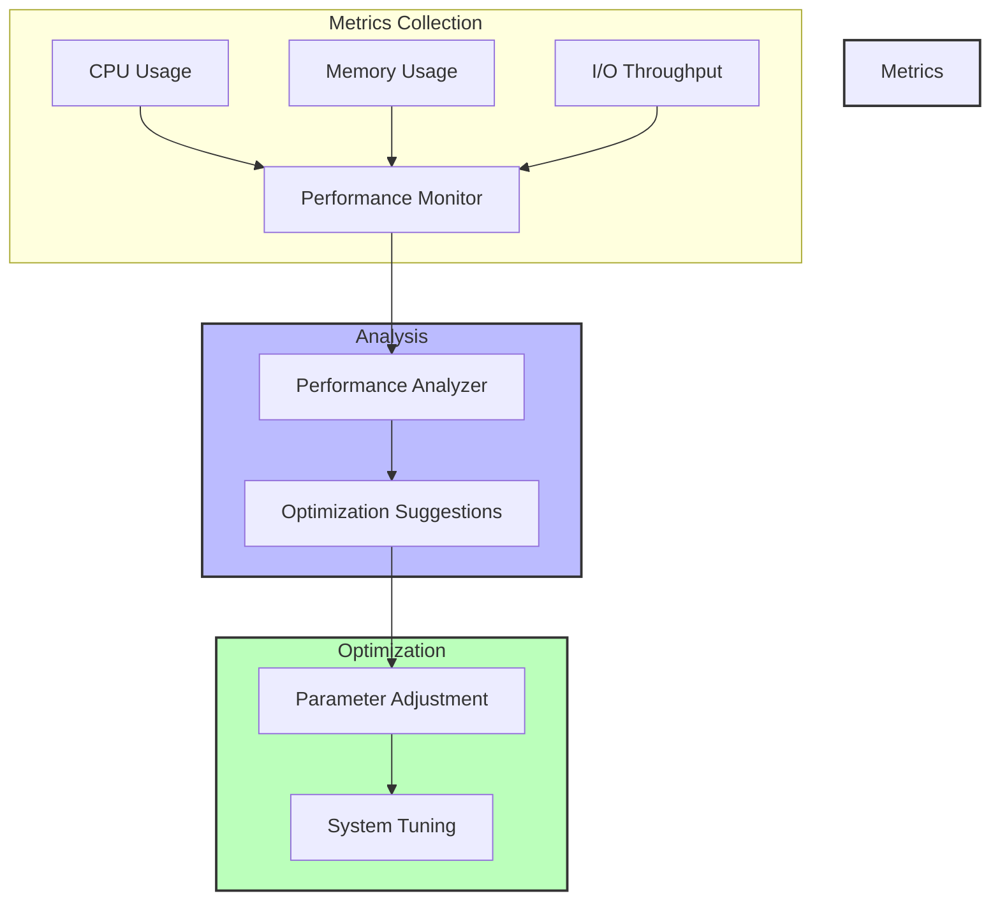
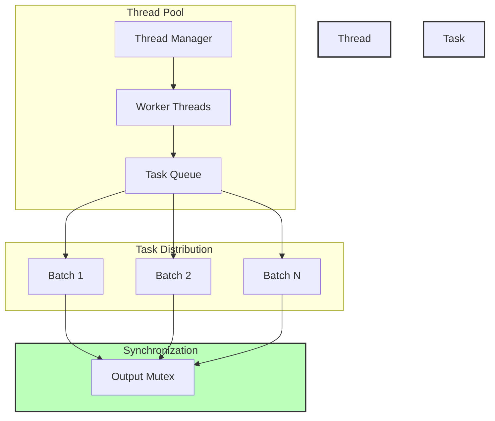
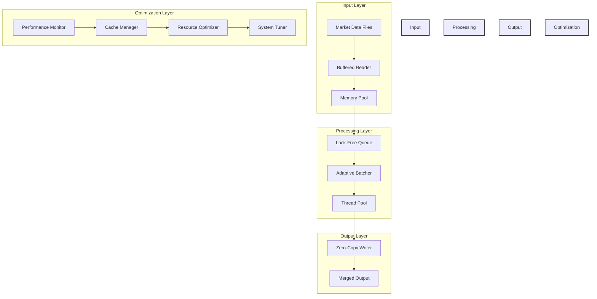

# Market Data Merger - Optimization Diagrams

## 1. Current System Architecture

## 2. Memory Pooling Architecture

## 3. Buffered Reading System

## 4. Lock-Free Queue Architecture

## 5. Adaptive Batch Sizing System

## 6. Caching System Architecture

## 7. Zero-Copy Operations Flow

## 8. Performance Monitoring System

## 9. Thread Management System

## 10. Overall System Architecture with Optimizations

