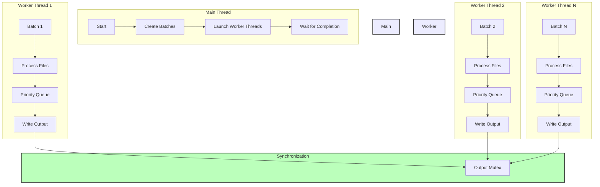

# Market Data Merger - Threading Implementation

## Threading Architecture



## Key Threading Components

1. **Batch Processing**
   ```cpp
   // Files are divided into batches
   if (currentBatch.size() >= batchSize || i == inputFiles.size() - 1)
   {
       threads.emplace_back(processBatch, currentBatch, outputFile, std::ref(outputMutex));
       currentBatch.clear();
   }
   ```

2. **Thread Synchronization**
   ```cpp
   // Mutex for thread-safe output
   std::mutex outputMutex;
   
   // Thread-safe writing
   {
       std::lock_guard<std::mutex> lock(outputMutex);
       outFile << entry.symbol << "," << entry.timestamp << "..." << "\n";
   }
   ```

3. **Thread Management**
   ```cpp
   // Create and store threads
   std::vector<std::thread> threads;
   
   // Wait for completion
   for (auto &thread : threads)
   {
       thread.join();
   }
   ```

## Threading Features

1. **Parallel Processing**
   - Each batch of files is processed in a separate thread
   - Default batch size is 500 files
   - Number of threads equals number of batches

2. **Thread Safety**
   - Output file writing is protected by mutex
   - Each thread has its own file readers
   - Priority queue is thread-local

3. **Resource Management**
   - Automatic thread cleanup via RAII
   - Proper mutex locking/unlocking
   - Exception-safe thread handling

## Performance Considerations

1. **Batch Size Impact**
   - Larger batch size = fewer threads but more memory per thread
   - Smaller batch size = more threads but less memory per thread
   - Default 500 provides good balance for most systems

2. **Memory Usage**
   - Each thread maintains its own set of file readers
   - Priority queue size depends on number of files in batch
   - Output buffer is shared but protected by mutex

3. **I/O Considerations**
   - File reading is parallelized across threads
   - File writing is serialized through mutex
   - Each thread processes its batch independently 